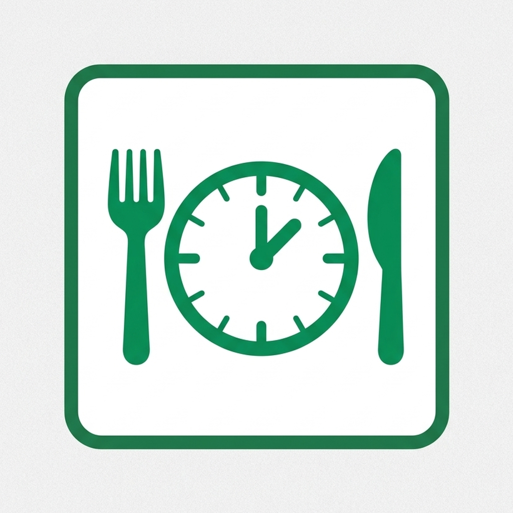

  

<h1 align="center">Gutsy</h1>

  
  
  
  

  A mobile food diary for tracking meals, symptoms, and intermittent fasting windows — built to help identify food-triggered digestive issues and share a readable diary with a dietician or physician.

---

## Features

- **Log food entries** — free text, optional photo, optional AI-assisted description
- **Log ache events** — timestamp, optional notes, optional severity (1–5)
- **Log toilet breaks** — timestamp, optional notes, optional Bristol stool type (1–7, configurable)
- **Log medication** — name (with autocomplete from history), optional notes
- **Track your fasting window** — first meal of the day starts the window; a notification fires before it closes
- **Day timeline** — browse your log day by day
- **Export to PDF** — select a date range and share with your doctor or dietician

## Install

Download the latest APK from the [Releases](../../releases/latest) page and sideload it on your Android device.

> **Note:** You may need to enable "Install from unknown sources" in your device settings.

## Building from source

See [docs/DEVELOPMENT.md](docs/DEVELOPMENT.md) for build instructions, tech stack, and architecture details.

## License

[PolyForm Noncommercial 1.0.0](LICENSE) — free to use for personal and non-commercial purposes.
